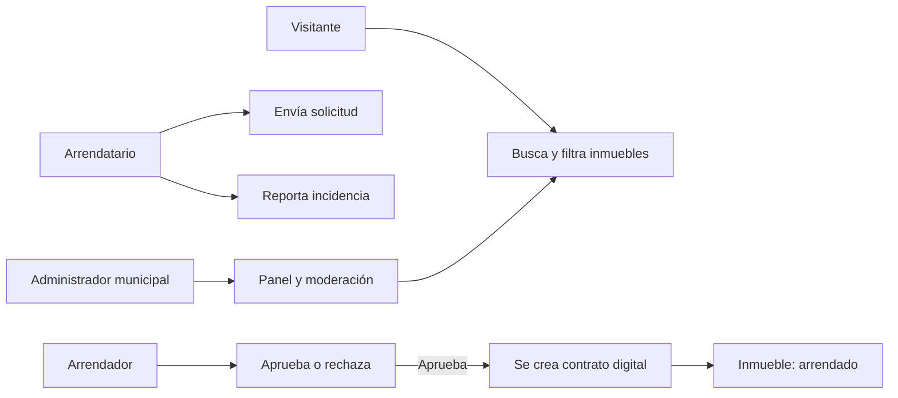
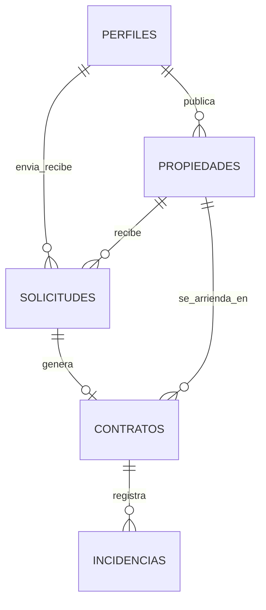

# 🏠 ManabíRent

> Plataforma web para centralizar la gestión de arriendos en Manabí, conectar a arrendadores con arrendatarios y dar al Municipio herramientas de supervisión.


**ManabíRent** es la implementación web del proyecto académico **Portoviejo 360 - Sistema de Gestión de Arriendos**. Nace para reemplazar los procesos dispersos de publicación, solicitud, contratación y mantenimiento por una experiencia digital trazable, con acceso diferenciado para arrendadores, arrendatarios y administración municipal.

## ✨ Qué resuelve

| Para quién | Valor principal |
| --- | --- |
| **Visitantes y arrendatarios** | Encuentran inmuebles, los filtran, ven su ubicación y envían solicitudes formales de arriendo. |
| **Arrendadores** | Publican y administran sus inmuebles, gestionan solicitudes y consultan contratos. |
| **Administración municipal** | Supervisa publicaciones y cuentas, y consulta indicadores consolidados del sistema. |

## 🧩 Funcionalidades

- **Autenticación y roles:** registro, inicio de sesión y rutas protegidas para `arrendador`, `arrendatario` y `admin`.
- **Catálogo de inmuebles:** búsqueda por texto, ciudad, tipo, precio y disponibilidad; vista en cuadrícula o mapa.
- **Gestión de propiedades:** creación, edición, eliminación, imágenes en Supabase Storage y estados `disponible`, `arrendada` y `mantenimiento`.
- **Solicitudes de arriendo:** el arrendatario postula a un inmueble disponible y el arrendador puede aprobar o rechazar con una respuesta.
- **Contratos digitales:** al aprobar una solicitud se crea una ficha contractual, el inmueble pasa a arrendado y las otras solicitudes pendientes se rechazan.
- **Historial contractual:** consulta y finalización de contratos vigentes para las dos partes.
- **Incidencias de mantenimiento:** los arrendatarios reportan novedades asociadas a contratos activos, con categoría, prioridad y estado.
- **Panel municipal:** KPIs, gráficos de inmuebles por ciudad y tipo, y moderación de usuarios y publicaciones.

## 🔄 Flujo principal



## 🛠️ Tecnologías

- **Frontend:** React 19, Vite y React Router.
- **Diseño:** Tailwind CSS y Lucide React.
- **Datos y autenticación:** Supabase Auth y PostgreSQL.
- **Archivos:** Supabase Storage para las fotografías de inmuebles.
- **Mapas:** React Leaflet y OpenStreetMap.
- **Indicadores:** Recharts.

## 🚀 Puesta en marcha

### 1. Requisitos

- Node.js 20 o superior.
- Un proyecto en [Supabase](https://supabase.com/) con Auth habilitado.

### 2. Instalar dependencias

```bash
npm install
```

### 3. Configurar variables de entorno

Crea el archivo `.env.local` en la raíz del proyecto:

```env
VITE_SUPABASE_URL=https://tu-proyecto.supabase.co
VITE_SUPABASE_ANON_KEY=tu-clave-anon
```

> La clave pública `anon` puede estar en el cliente; nunca incluyas una `service_role` en este archivo ni en el frontend.

### 4. Preparar la base de datos

En el **SQL Editor** de Supabase, ejecuta los scripts en este orden:

1. `supabase/schema.sql` - propiedades, Storage e imágenes.
2. `supabase/schema_modulo3.sql` - solicitudes, contratos e incidencias.
3. `supabase/schema_modulo6.sql` - perfiles, moderación y panel municipal.

> `supabase_setup.sql` corresponde a una configuración inicial alternativa. Para una instalación nueva, usa la secuencia anterior y evita ejecutar ambos esquemas de perfiles.

### 5. Iniciar la aplicación

```bash
npm run dev
```

Abre la dirección indicada por Vite, normalmente `http://localhost:5173`.

## 📜 Scripts disponibles

| Comando | Descripción |
| --- | --- |
| `npm run dev` | Inicia el entorno local con recarga en caliente. |
| `npm run build` | Genera la versión optimizada en `dist/`. |
| `npm run preview` | Sirve localmente la compilación de producción. |
| `npm run lint` | Analiza el código con ESLint. |

## 👥 Accesos por rol

| Función | Visitante | Arrendatario | Arrendador | Admin |
| --- | :---: | :---: | :---: | :---: |
| Explorar inmuebles y mapa | ✅ | ✅ | ✅ | ✅ |
| Enviar solicitudes | — | ✅ | — | — |
| Reportar incidencias | — | ✅ | — | — |
| Publicar y gestionar inmuebles | — | — | ✅ | — |
| Responder solicitudes y contratos | — | Consulta | ✅ | Consulta |
| Consultar panel y moderar | — | — | — | ✅ |

## 🗂️ Estructura del proyecto

```text
src/
├── components/       # Componentes reutilizables y protección de rutas
├── context/          # Sesión y estado de autenticación
├── data/             # Datos de demostración como respaldo visual
├── lib/              # Acceso a Supabase y lógica de dominio
├── pages/            # Vistas de inmuebles, contratos, incidencias y panel
├── App.jsx           # Rutas y composición de la aplicación
└── main.jsx          # Punto de entrada
supabase/
├── schema.sql        # Módulo de propiedades y Storage
├── schema_modulo3.sql# Solicitudes, contratos e incidencias
└── schema_modulo6.sql# Perfiles, moderación y estadísticas
```

## 🗃️ Modelo de datos



Las entidades principales son `perfiles`, `propiedades`, `solicitudes`, `contratos` e `incidencias`. El sistema conserva datos relevantes de cada operación dentro de solicitudes, contratos e incidencias para mantener el historial aunque un anuncio cambie posteriormente.

## 🔐 Consideraciones de seguridad

La aplicación utiliza Supabase Auth y separa la interfaz por roles. Los scripts SQL actuales incluyen políticas RLS permisivas para facilitar el contexto académico y de prototipo.

Antes de publicar el sistema en producción, se debe:

- Sustituir las políticas de prototipo por políticas RLS que validen `auth.uid()` y el rol del usuario.
- Limitar las operaciones de moderación exclusivamente a administradores municipales.
- Restringir la subida y eliminación de fotografías al propietario correspondiente.
- Revisar la validación de datos, auditoría y requisitos legales aplicables, incluida la LOPDP de Ecuador.

## 🎯 Alcance actual

El proyecto cubre la gestión de arriendos, contratos digitales, mantenimiento y supervisión municipal. No incorpora pasarela de pagos, firma electrónica avanzada, notificaciones externas, chat en tiempo real ni aplicación móvil nativa.

## 📚 Contexto del proyecto

Desarrollado para la asignatura **Sistemas de Información** de la carrera de Ingeniería de Software, PUCE Manabí (2026). Su propuesta funcional está documentada en *Portoviejo 360 - Sistema de Gestión de Arriendos*.

---

<p align="center">
  Hecho para una gestión de arriendos más clara, segura y accesible en Manabí. 🌊
</p>
