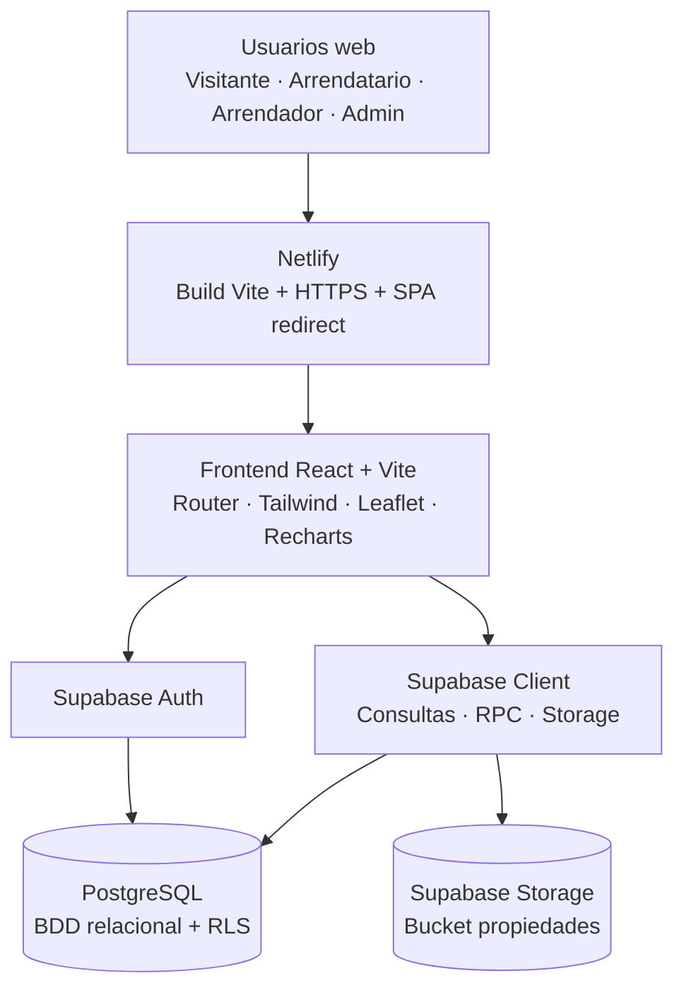
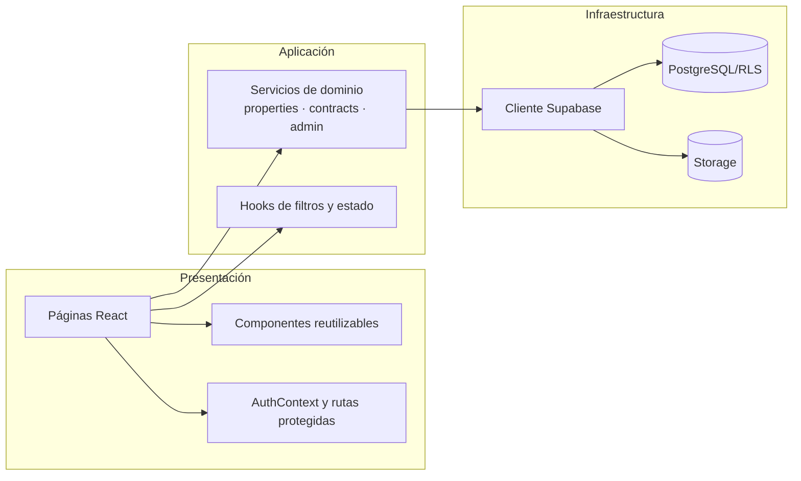
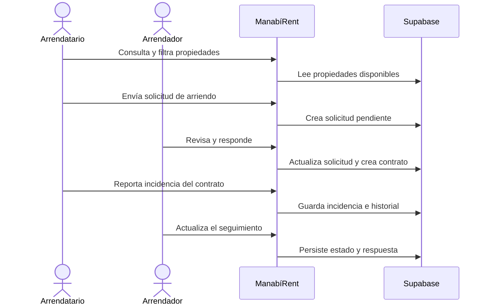
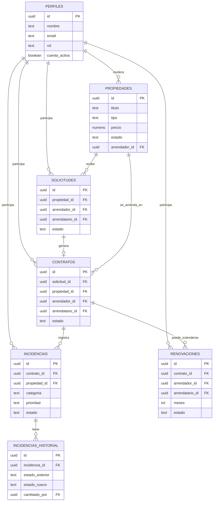

# Modelado y base de datos - ManabíRent

Este documento reúne los diagramas técnicos de **Portoviejo 360 - ManabíRent**. Mermaid permite versionarlos y recrearlos en Lucidchart, Miro o draw.io.

## Arquitectura lógica

## Componentes y responsabilidades

## Flujo principal de negocio

## Diagrama entidad-relación (DER)

## Orden de ejecución

Para una instalación nueva en Supabase se recomienda ejecutar `BDD.sql`. El script mantiene la compatibilidad con el prototipo actual. Antes de producción deben sustituirse las políticas RLS permisivas por reglas basadas en `auth.uid()` y rol.
